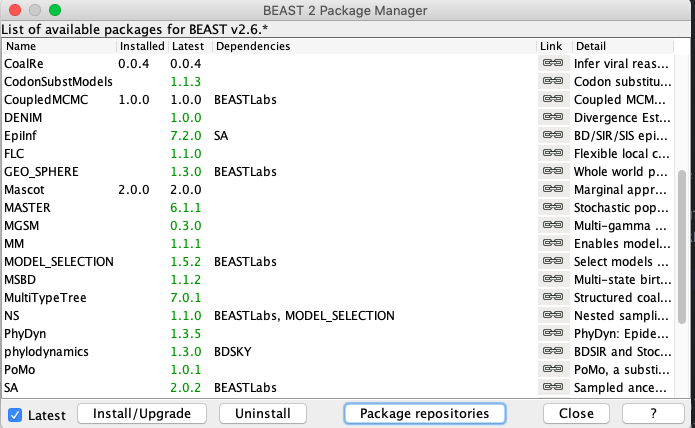
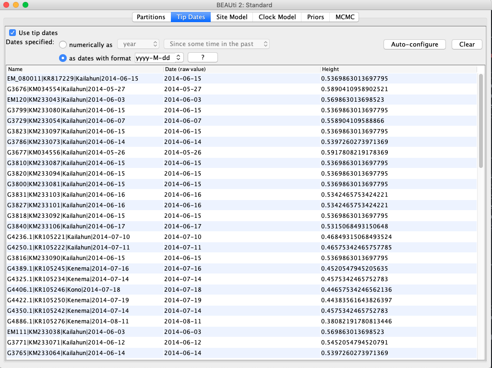
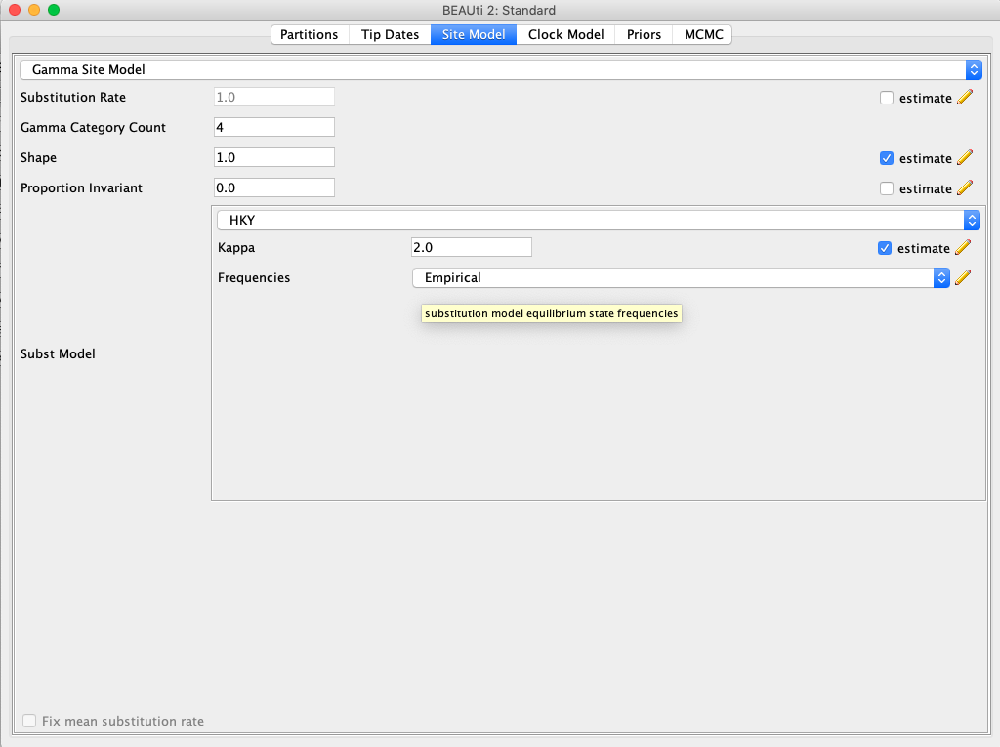
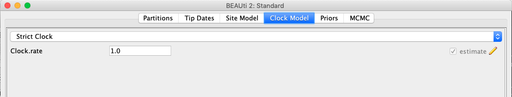
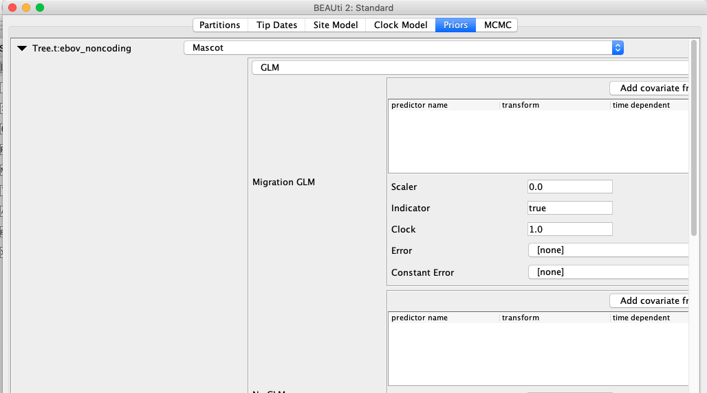
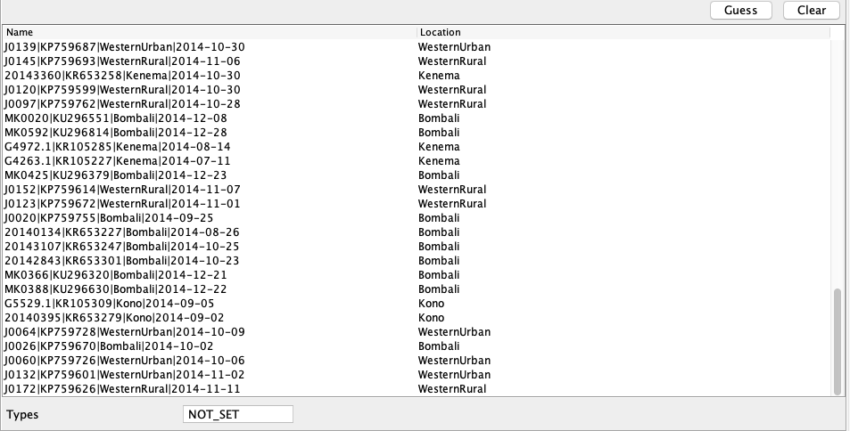
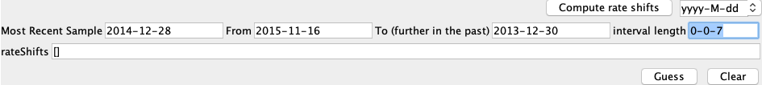
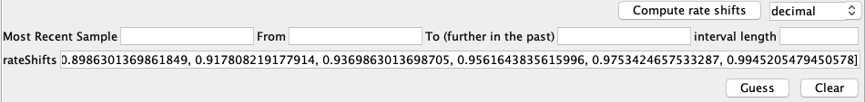
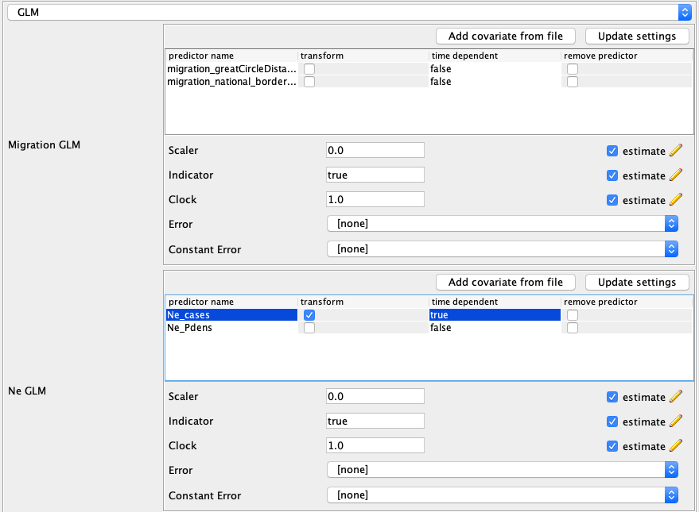

# Background

Phylogeographic methods can help reveal the movement of genes between populations of organisms. This has been widely used to quantify pathogen movement between different host populations, the migration history of humans, and the geographic spread of languages or the gene flow between species using the location or state of samples alongside sequence data. Phylogenies therefore offer insights into migration processes not available from classic epidemiological or occurrence data alone.

If we want to analyse datasets with many different states and want to allow rates to change through time however, the number of parameters we have to infer grows dramatically and the phylogenies themselves might not be able to inform all these rates. Alternatively, we can use predictors data, such as geographic distance between states, to inform these rates.
Additionally, we might be interested in what governs coalescence within and migration between states. To do, GLM models can be used which allow to use predictor data to inform differences in effective population sizes and migration rates between states and through time. GLM models have first been introduced to phylogenetics for discrete trait analyses , where predictor data is used to inform migration rates between locations in a neutral model of trait evolution.

In , the GLM approach is used to inform time varying migration rates between states and effective population sizes within states from time varying predictor data.
This tutorial gives an introduction into how a MASCOT-GLM analysis in BEAST2 can be set-up. MASCOT is short for **M**arginal **A**pproximation of the **S**tructured **CO**alescen **T**   and implements the GLM approach to inform effective population sizes and migration rates from predictor data.

----

# Programs used in this Exercise

### BEAST2 - Bayesian Evolutionary Analysis Sampling Trees 2

BEAST2 ([http://www.beast2.org](http://www.beast2.org)) is a free software package for Bayesian evolutionary analysis of molecular sequences using MCMC and strictly oriented toward inference using rooted, time-measured phylogenetic trees. This tutorial is written for BEAST v{{ page.beastversion }} .

### BEAUti2 - Bayesian Evolutionary Analysis Utility

BEAUti2 is a graphical user interface tool for generating BEAST2 XML configuration files.

Both BEAST2 and BEAUti2 are Java programs, which means that the exact same code runs on all platforms. For us it simply means that the interface will be the same on all platforms. The screenshots used in this tutorial are taken on a Mac OS X computer; however, both programs will have the same layout and functionality on both Windows and Linux. BEAUti2 is provided as a part of the BEAST2 package so you do not need to install it separately.

### TreeAnnotator

TreeAnnotator is used to summarise the posterior sample of trees to produce a maximum clade credibility tree. It can also be used to summarise and visualise the posterior estimates of other tree parameters (e.g. node height).

TreeAnnotator is provided as a part of the BEAST2 package so you do not need to install it separately.

### Tracer

Tracer ([http://tree.bio.ed.ac.uk/software/tracer](http://tree.bio.ed.ac.uk/software/tracer)) is used to summarise the posterior estimates of the various parameters sampled by the Markov Chain. This program can be used for visual inspection and to assess convergence. It helps to quickly view median estimates and 95% highest posterior density intervals of the parameters, and calculates the effective sample sizes (ESS) of parameters. It can also be used to investigate potential parameter correlations. We will be using Tracer v{{ page.tracerversion }}.

### FigTree

FigTree ([http://tree.bio.ed.ac.uk/software/figtree](http://tree.bio.ed.ac.uk/software/figtree)) is a program for viewing trees and producing publication-quality figures. It can interpret the node-annotations created on the summary trees by TreeAnnotator, allowing the user to display node-based statistics (e.g. posterior probabilities). We will be using FigTree v{{ page.figtreeversion }}.

----

# Practical: Inferring predictor of effective population sizes and migration rates

In this tutorial we will estimate the predictors of migration rates and effective population sizes using the marginal approximation of the structured coalescent implemented in BEAST2, MASCOT .

The aim is to:

-  Learn how to setup a MASCOT-GLM analysis
-  Learn how to read the output of a MASCOT analysis

## Setting up an analysis in BEAUti

### Download MASCOT

*For now:* At the moment, this only works with a pre-release of MASCOT v2.0.0.

First, we have to download the package MASCOT using the BEAUTi package manager. Go to _File >> Manage Packages_.
Then , press *package repositories* and add the following URL: 'https://raw.githubusercontent.com/nicfel/Mascot/master/package.xml'.
Now, the newest version of MASCOT should be v2.0.0.
Press *Install/Upgrade*

 and download the package MASCOT.

<figure>
	
	
	<figcaption>Figure 1: Download the MASCOT package.</figcaption>
</figure>

MASCOT will only be available in BEAUti once you close and restart the program.

### Loading the Ebola Virus (EBOV) Sequences (Partitions)

The sequence alignment is in the file [ebov_noncoding.fasta](http://github.com/nicfel/GLM-Tutorial/raw/master/data/ebov_noncoding.fasta). Right-click on this link and save it to a folder on your computer.
Once downloaded, this file can either be drag-and-dropped into BEAUti or added by using BEAUti's menu system via _File >> Import Alignment_.
Make sure thay you specify this alignment to be a nucleotide alignment and not a aminoacid alignment.
Once the sequences are added, we need to specify the sampling dates and locations.

### Get the sampling times (Tip Dates)

Open the "Tip Dates" panel and then select the "Use tip dates" checkbox.

The sampling times are encoded in the sequence names.  
First, set the *as dates with format* to *yyyy-M-dd*.
We can tell BEAUti to use these by clicking the _Auto-configure_ button.
The sampling times appear following the third vertical bar "|" in the sequence name.
To extract these times, select "split on character", enter "|" (without the quotes) in the text box immediately to the right, and then select "4" from the drob-down box to the right, as shown in the figure below.

<figure>
	
	
	<figcaption>Figure 2: Guess sampling times.</figcaption>
</figure>

Clicking "Ok" should now populate the table with the sample times extracted from the sequence names: the column **Date** should now have all values in 2014 and the column **Height** should have values below 1.
The heights denote the time difference from a sequence to the most recently sampled sequence.
If everything is specified correctly, the sequence with Height 0.0 should have Date *2014-12-28*.
We will need to know the date of the most recent sampled individual later.

### Specify the Site Model (Site Model)

Next, we have to specify the site model.
To do this, choose the "Site Model" tab.
We here choose a simple model, the HKY model, that allows us to account for differences in transversion and transition rates, meaning that changes between bases that are chemically more closely related (transitions) are allowed to have a different rate to changes between bases that chemically more distinct (transversions).
Additionally, we should allow for different rate categories for different sires in the alignment.
This can be done by setting the _Gamma Category Count_ to 4, which is just a value that has typically been used.
Make sure that estimate is checked next to the shape parameter.
To reduce the number of parameters we have to estimate, we can set Frequencies to Empirical.

<figure>
	
	
	<figcaption>Figure 4: Set the site model.</figcaption>
</figure>

### Set the clock model (Clock Model)

For rapidly evolving viruses, the assumption of a strict molecular clock is often made, meaning that the molecular clock is the same on each branch of the phylogeny.
We can leave the clock model setup to the default.

<figure>
	
	
	<figcaption>Figure 5: Set the initial clock rate.</figcaption>
</figure>

### Setting up the MASCOT-GLM Model (Priors)

Next, go to the `Priors` panel.
On the top, there is a drop down menu where the different tree priors can be specified.
There, choose 'Mascot'.
This will add an additional drop down menu where the different dynamics can be chosen.
Choose *GLM*, which will allow us to setup the actual GLM model.

<figure>
	
	
	<figcaption>Figure 3: Choose MASCOT and GLM dynamics.</figcaption>
</figure>

## Get the sampling locations (Priors)
The first step in setting up the GLM model is to specify the sampling locations.
As for the sampling times, sampling locations can be extracted from the sequence names.  
After clicking the _Guess_ button, you can split the sequence on the
vertical bar "|" again by selecting "split on character" and entering
"|" in the box.
The locations are in the third group, so choose "3" from the drop-down menu.
After clicking the _OK_
button, the window should look like the one shown in the figure below:

<figure>
	
	
	<figcaption>Figure 3: Specifying sample locations.</figcaption>
</figure>

## Specify when the to change between different entries of the time varying Predictors (Priors)

When using predictors that have different entries at different points in times, we have to let the model know when to switch between those entries.
Here, the case data is specified on a weekly basis and we therefore have to specify when to change between entries of the case data.
We do this be setting the rate shifts.
First, set the format in which the dates will be specified to *yyyy-MM-dd*.
The most recent sample was sampled on *2014-12-28*.
This can be checked by going back to the `Tip Dates` panel.
The most recent sample is the one with height 0.
The next thing we have to define is when the most recent entry of the predictor vector is from.
The most recent entry defines the weekly case in the week of the *2015-11-16*, which will be our *From* value.
The last entry of the case data predictor is of the week of the *2013-12-30*, which will be our  *To* value.
*Interval Length* defines how much time there is between different entries of a predictor.
Since we have weekly cases, this is 7 days.
The way to input this is in the same date format as all the other values, i.e. *0-0-7*.
Next, press *compute rate shift*, which will convert the date information into decimal values.
If nothing happens, the format is most likely still in decimal or there is an error in one of the dates.

Since the most recent sample is further in the past than the most recent predictor entry, the first entries of rate shift will be negative.

<figure>
	
	
	<figcaption>Figure 3: Rate shifts before compute rate shift.</figcaption>
</figure>

<figure>
	
	
	<figcaption>Figure 3: Rate shifts after compute rate shift.</figcaption>
</figure>

After this is setup, make sure to press *Update Settings* on the left side.
This is absolutely crucial for adding predictors.
BEAUTi will automatically make sure that the dimensions of the predictors are correct.
To do so, it requires to know how many different locations there are and how many different rate intervals.

### Adding the predictor data (Priors)

There are different kind of predictor that can be inputted, migration rate and effective population size predictors.
Migration rate predictors are predictors between different locations and are therefore a matrix.
Effective population size predictors are within a population and are therefore vectors.

To load the migration rate predictors, press *Add predictor from File* in the *Migration GLM* box and select the file `migration_greatCircleDistances.csv`.
This predictor denotes the log-standardized distances between the population centers of different location.
Next, also add the file `migration_national_border_shared.csv`.
This predictor denotes if two locations are located next to each other.

To add the effective population size predictor, do the same in the *Ne GLM* box.
There, add the predictors `Ne_cases.csv` and `Ne_Pdens.csv`.
The predictor Ne_cases denotes the number of weekly cases.
These cases are not yet log-standardized and we therefore have to click the transform button next to the predictor name.
This will to the log-standardization for us.
After doing so, click the *Update Settings* button.

Because log(0) is negative infinity, 0 values in a predictor before any transformation are not allowed.
Instead, the predictor is 0.001 in a week and location where there were no cases at all.

At the end, the setup should look like the following:

<figure>
	
	
	<figcaption>Figure 3: Settings of the predictors.</figcaption>
</figure>

### Specify the priors (Priors)

Now, we need to set the parameter priors for the various parameters of the model.
The priors with *Clock* in the name are priors on the overall scalers of the effective population sizes and migration rates and denote something closely related to priors on the average rate of migration or effective population size.
The priors with *Scaler* in the name, denote the priors on the coefficients of individual predictors.
These are typically normally distributed and can be left like they are.

The priors with *sumActivePredictors* in the name denote the prior distributed on the number of active predictors.
These should be chosen such that models with fewer predictors are preferred to those with more predictors.
We here chose a lambda of 0.5.
After setting up everything, it should look something like:

<figure>
	
	
	<figcaption>Figure 6: Set up of the prior distributions.</figcaption>
</figure>

### Specify the MCMC chain length (MCMC)

Now switch to the "MCMC" tab. Here we can set the length of the MCMC
chain and decide how frequently the parameter and trees are
logged. For this dataset, 2 million iterations should be
sufficient. In order to have enough samples but not create too large
files, we can set the logEvery to 5000, so we have 401 samples
overall. Next, we have to save the `*.xml` file using _File >> Save
as_.

<figure>
	
	
	<figcaption>Figure 7: save the \*.xml.</figcaption>
</figure>

----

# Useful Links

If you interested in the derivations of the marginal approximation of the structured coalescent, you can find them here . This paper also explains the mathematical differences to other methods such as the theory underlying BASTA. To get a better idea of how the states of internal nodes are calculated, have a look in this paper .

- MASCOT source code: [https://github.com/nicfel/Mascot](https://github.com/nicfel/Mascot)
- [Bayesian Evolutionary Analysis with BEAST 2](http://www.beast2.org/book.html) 
- BEAST 2 website and documentation: [http://www.beast2.org/](http://www.beast2.org/)
- Join the BEAST user discussion: [http://groups.google.com/group/beast-users](http://groups.google.com/group/beast-users)

----

# Relevant References


